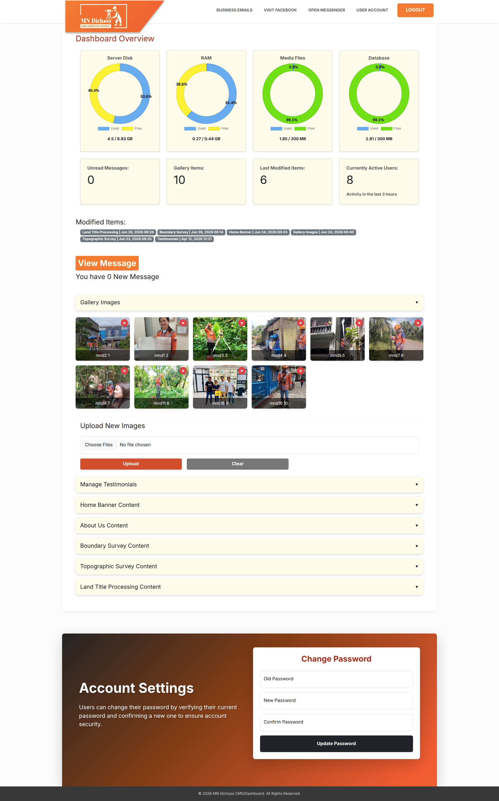
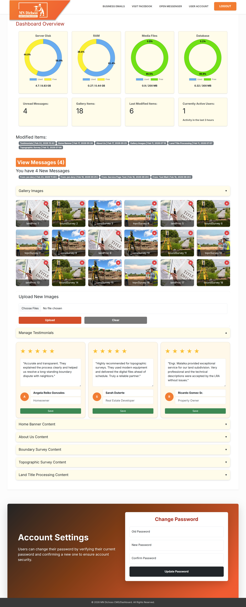
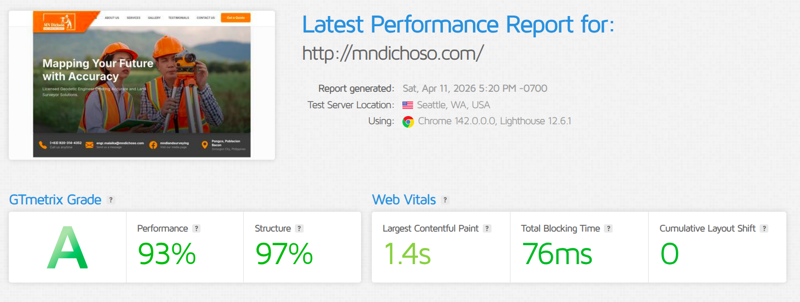
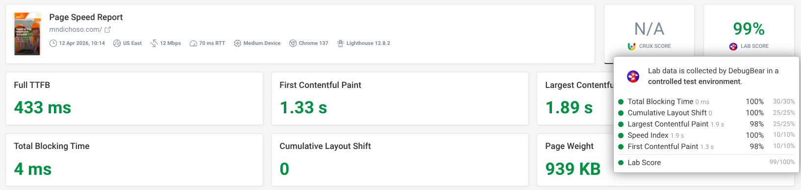
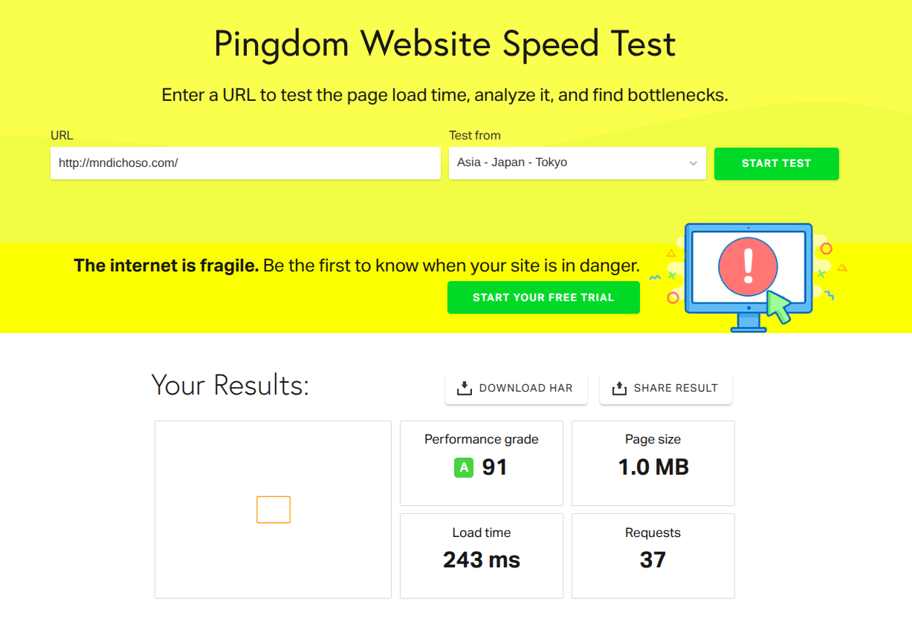

# MNDweb Showcase

## Delivering Production Quality Under Real-World Infrastructure Constraints

MNDweb is a showcase of how a complete business platform was designed, optimized, and deployed while working within strict client constraints.

The challenge was not simply building a website.

The real challenge:

> How can we deliver a reliable, maintainable, and fast platform while respecting the client's infrastructure budget?

The result is a production-ready business platform built around efficiency, automation, and operational visibility.

---

# 🌐 Live Website

The production website is available at:

🔗 https://mndichoso.com

The showcase repository focuses on the architecture, engineering decisions, and production lessons behind the platform.

---

# 🎯 Project Goals

MNDweb was built to provide:

* A professional business website
* A custom content management system
* Operational visibility for the owner
* Efficient resource usage
* Automated maintenance
* Reliable performance on limited infrastructure

The project focused on making better engineering decisions instead of relying on expensive infrastructure.

---

# 🏗️ Architecture Philosophy

MNDweb follows a modular monolith approach designed for simplicity and efficiency.

Instead of introducing unnecessary infrastructure complexity, the system focuses on:

* Clear separation of responsibilities
* Maintainable backend structure
* Efficient resource usage
* Automated operational tasks

The goal was:

> Build only what is needed, but build it properly.

---

# 🌐 Platform Overview

MNDweb includes a public-facing business website powered by a custom backend and CMS.

## Website


## Client Content Deployment

The platform was deployed using actual client content and assets.


## CMS Content Management

The owner can manage the platform through a custom CMS interface.



---

# 🖥️ Custom CMS + Operational Monitoring

A key requirement was giving the business owner more control and visibility without requiring direct server access.

The CMS provides:

* Content management
* Business administration
* Operational visibility
* System monitoring information

The platform includes server resource monitoring directly inside the CMS.



---

# ⚡ Performance Engineering Under Constraints

MNDweb was designed and tested on a constrained VPS environment:

```text
Infrastructure:

- 512MB RAM VPS
- 10GB Storage
```

Instead of increasing infrastructure costs, the system was optimized through engineering decisions.

The CMS monitoring dashboard shows the actual runtime environment:

```text
Memory:
0.27 / 0.44 GB

Disk:
4.7 / 8.83 GB
```

This demonstrates that the platform operates efficiently within the available resources.

---

# 🚀 Optimization Strategies

## Automatic WebP Image Conversion

Images are automatically optimized to reduce:

* Storage usage
* Bandwidth consumption
* Page loading time

This is especially important in a limited storage environment.

---

## Background Processing with Celery + Redis

Heavy or delayed operations are handled asynchronously.

Celery and Redis help:

* Keep user requests responsive
* Move background work away from the main request cycle
* Improve application reliability

---

## Automated Maintenance with Cron Jobs

MNDweb includes scheduled maintenance tasks.

Every Sunday at 3:00 AM, automated cleanup routines run:

* Remove orphaned files
* Clean logs
* Clean dumps
* Maintain storage health

The platform is designed to reduce manual server maintenance.

---

# 📊 Performance Validation

The platform was tested using multiple performance tools.

## GTmetrix



## Google PageSpeed



## Pingdom



These results demonstrate that careful architecture and optimization can achieve strong performance even with limited infrastructure.

---

# 🧠 Engineering Lessons

MNDweb represents an important engineering principle:

> Quality comes from good decisions, not only expensive infrastructure.

The project demonstrates:

* Understanding client constraints
* Designing within limitations
* Optimizing before scaling
* Building maintainable systems
* Automating repetitive operations

---

# 🛠️ Technology Stack

## Backend

* Django
* Python
* PostgreSQL/SQLite depending on deployment requirements

## Frontend

* HTML
* CSS
* JavaScript

## Background Processing

* Celery
* Redis

## Infrastructure

* Linux VPS
* Nginx
* Gunicorn
* Cron automation

## Optimization

* WebP image conversion
* Media optimization
* Resource monitoring

---

# 🔒 Source Code Notice

This repository is a technical showcase of the architecture, engineering decisions, and lessons learned from the project.

The original client source code is private and remains owned by the client.

This showcase intentionally excludes:

* Private business logic
* Client data
* Production credentials
* Internal proprietary code

The purpose is to demonstrate engineering approach, not expose client assets.

---

# 📌 Final Thoughts

MNDweb demonstrates that reliable software does not always require expensive infrastructure.

With careful architecture, automation, and optimization, a complete business platform can run efficiently even under strict resource constraints.

The focus was never:

> "How much infrastructure can we buy?"

The focus was:

> "How much quality can we deliver with what we have?"

---

