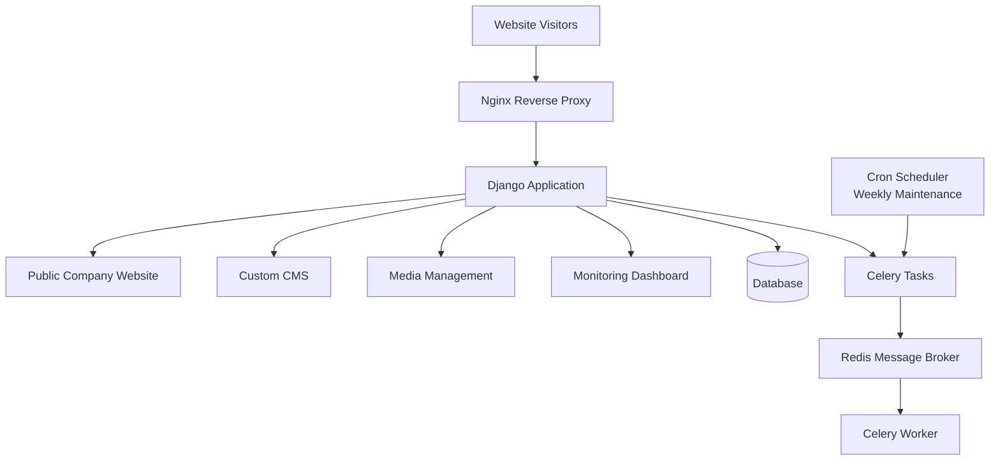

# Architecture

## System Overview

MNDweb follows a modular monolith architecture designed for a small production environment.

The system was intentionally built as a single deployable application while maintaining clear internal boundaries between different functional areas.

This approach provided:

- Simple deployment
- Lower infrastructure overhead
- Easier maintenance
- Clear separation of responsibilities

The architecture balances production reliability with the constraints of a 512MB RAM VPS environment.

---

## System Architecture Diagram

The architecture separates user-facing workloads from background operations while keeping the entire system within a single deployment environment.

This design allows MNDweb to provide production functionality without introducing unnecessary infrastructure complexity.

---

## Modular Monolith Design

Instead of separating the system into multiple independent services, MNDweb uses a modular monolith approach.

The application is organized into logical modules that communicate internally while sharing the same deployment environment.

Each module maintains a clear responsibility while sharing common resources such as:

- Application runtime
- Database access
- Authentication layer
- Deployment environment

Benefits of this approach:

- Reduced operational complexity
- Lower memory consumption
- Easier debugging
- Faster development cycles

The architecture avoids premature microservice complexity while keeping the codebase structured enough for future expansion.

---

## Application Structure

The system is divided into functional modules with clear responsibilities.

Core areas include:

### Public Company Website

The public-facing website provides the primary customer experience and delivers company information and services.

### Custom CMS

A custom content management system allows controlled updates to website content and business information.

### Media Management

Media handling manages uploaded assets and ensures efficient storage organization.

### Monitoring Dashboard

The monitoring dashboard provides visibility into system activity and operational status.

### Background Processing

Asynchronous workers handle tasks that should not block normal user requests.

Each component operates within the same application ecosystem while maintaining separation of concerns.

---

## Background Processing

MNDweb uses asynchronous processing for tasks that should not block user requests.

Background workloads include:

- Maintenance operations
- Scheduled cleanup tasks
- Resource-intensive processing

The asynchronous workflow uses:

- Celery for task execution
- Redis as the message broker

This allows the main application process to remain responsive while background operations are executed separately.

Separating these workloads prevents maintenance tasks from affecting the user-facing experience.

---

## Content Management System

A custom CMS was developed to allow content updates without requiring direct database modifications.

The CMS provides controlled management of:

- Website content
- Media assets
- Business information

Building a custom CMS allowed the system to match the client's workflow instead of adapting the workflow to an external platform.

This approach also reduced dependency on third-party solutions while keeping the system lightweight.

---

## Monitoring and Maintenance

The system includes operational monitoring and automated maintenance processes.

Scheduled maintenance handles:

- Log cleanup
- Orphaned file cleanup
- Resource management

A weekly cron-based cleanup process runs every Sunday at 3:00 AM to maintain storage efficiency.

Automation ensures that routine maintenance tasks are performed consistently without requiring manual intervention.

---

## Architecture Decisions

The architecture was guided by practical constraints:

- Keep deployment simple
- Reduce memory overhead
- Avoid unnecessary services
- Automate repetitive maintenance
- Preserve future scalability options

A modular monolith provided the right balance between maintainability and infrastructure efficiency.

The goal was not to maximize the number of deployed components, but to maximize reliability within the available resources.

---

## Lessons Learned

Small infrastructure does not require small engineering.

The project demonstrated that a carefully designed monolith can deliver production functionality without the operational complexity of distributed systems.

Good architecture is not measured by the number of services deployed, but by how effectively the system solves the actual problem within its constraints.